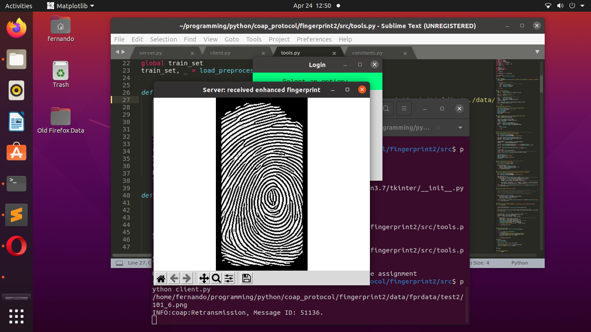

Authentication System using CoAP protocol
================
Andres Fernando Garcia
6/21/2021

## Project details

The project consists of implementing the Constrained Application
Protocol
([CoAP](https://en.wikipedia.org/wiki/Constrained_Application_Protocol))
in an authentication
[IoT](https://en.wikipedia.org/wiki/Internet_of_things) system. CoAP is
a web protocol for constrained devices that fulfilling
[M2M](https://en.wikipedia.org/wiki/Machine_to_machine) (Machine to
machine) requirements. Some characteristics of this work are:

  - The application depends on encrypting a client biometric
    (fingerprint) by a symmetric key and validating the client on the
    server-side by decrypting a symmetric key.
  - The application encrypts authentification messages and resource
    responses using Advanced Encryption Standard (AES).
  - Keys have 128 bits long.
  - This work operates under the
    [CCM](https://en.wikipedia.org/wiki/CCM_mode) (Counter with Cipher
    block chaining Message authentication code; counter with CBC-MAC)
    mode.

## The process

The client signs up in the proposed application by registering his
biometric and the symmetric key (in this case with a database). The
client biometric will be encrypted by a symmetric key. Then, the
encrypted biometric will be sent to the server, which will decrypt the
symmetric key and store the biometric.

When the client login to the application the next time, the server will
validate the client by decrypting the symmetric key and comparing his
biometric with the stored biometric. If the decrypted biometric is the
same as the stored biometric, then the client is authenticated. So, the
server will grant him access to all connected devices. As a result, the
client has access to the app (Camera).

## Screenshots

 
 
 
